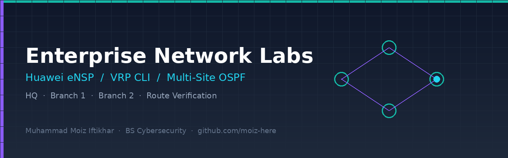
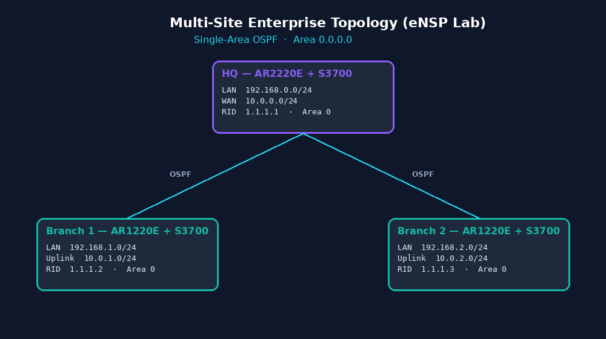
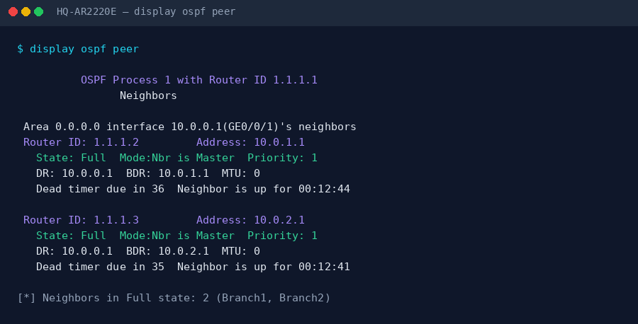
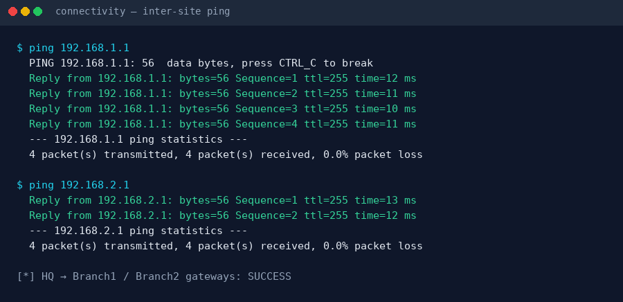

# Enterprise Network Labs — Huawei eNSP / VRP

Multi-site enterprise network design and configuration using **Huawei eNSP** and **VRP CLI**.  
This repository documents my hands-on networking foundation ahead of network security specializations.

<p align="center">
  
</p>

<p align="center">
  
  
  
  
</p>

---

## Overview

Complete enterprise network labs on Huawei eNSP with AR-series routers and S3700 switches. Focus areas:

- Multi-site topology design (HQ + 2 branches)
- Single-area OSPF
- Route summarization
- End-to-end connectivity verification
- Convergence and basic troubleshooting

### Key outcomes

- Designed and configured a **3-site enterprise network** (HQ, Branch 1, Branch 2)
- Implemented **single-area OSPF** with consistent addressing
- Validated **end-to-end connectivity** across sites
- Documented routing tables, neighbor status, and test results
- Archived full device configurations for reproducibility

---

---

## Quick start 

1. **Open Huawei eNSP**
2. **Import topology** from [`topologies/multi-site-enterprise/`](topologies/multi-site-enterprise/)
3. **Load configurations** from [`configurations/`](configurations/) folder onto respective devices
4. **Start all devices** and verify OSPF neighbors form correctly
5. **Run verification commands** from [`verification/`](verification/) folder

Estimated setup time: **15–20 minutes**

---

## Network topology

### Multi-site enterprise architecture

```
                    ┌─────────────────────┐
                    │   HQ (Area 0)       │
                    │  AR2220E + S3700    │
                    │  10.0.0.0/24        │
                    │  192.168.0.0/24     │
                    └──────────┬──────────┘
                               │
              ┌────────────────┼────────────────┐
              │                                 │
              ▼                                 ▼
┌─────────────────────┐             ┌─────────────────────┐
│  Branch 1 (Area 0)  │             │  Branch 2 (Area 0)  │
│  AR1220E + S3700    │             │  AR1220E + S3700    │
│  10.0.1.0/24        │             │  10.0.2.0/24        │
│  192.168.1.0/24     │             │  192.168.2.0/24     │
└─────────────────────┘             └─────────────────────┘
```

<p align="center">
  
</p>

| Site | Router | Switch | OSPF Area | Networks |
|------|--------|--------|-----------|----------|
| **HQ** | Huawei AR2220E | Huawei S3700 | Area 0 | `10.0.0.0/24`, `192.168.0.0/24` |
| **Branch 1** | Huawei AR1220E | Huawei S3700 | Area 0 | `10.0.1.0/24`, `192.168.1.0/24` |
| **Branch 2** | Huawei AR1220E | Huawei S3700 | Area 0 | `10.0.2.0/24`, `192.168.2.0/24` |

Full design notes: [`topologies/multi-site-enterprise/`](topologies/multi-site-enterprise/)

---

## Addressing plan (summary)

| Site | LAN | WAN / Link | Router LAN IP | Notes |
|------|-----|------------|---------------|-------|
| HQ | 192.168.0.0/24 | 10.0.0.0/24 | 192.168.0.1 | Core / ABR-style summary point |
| Branch 1 | 192.168.1.0/24 | 10.0.1.0/24 | 192.168.1.1 | Spoke |
| Branch 2 | 192.168.2.0/24 | 10.0.2.0/24 | 192.168.2.1 | Spoke |

Detailed plan: [`topologies/multi-site-enterprise/addressing-plan.md`](topologies/multi-site-enterprise/addressing-plan.md)

---

## Configuration highlights

### OSPF (HQ router — excerpt)

```text
ospf 1
 area 0.0.0.0
  network 10.0.0.0 0.0.0.255
  network 192.168.0.0 0.0.0.255
```

### Route summarization (concept)

```text
ospf 1
 area 0.0.0.0
  abr-summary 10.0.0.0 255.255.0.0
```

Full device configs:

- [`configurations/hq-router/`](configurations/hq-router/)
- [`configurations/branch1-router/`](configurations/branch1-router/)
- [`configurations/branch2-router/`](configurations/branch2-router/)
- [`configurations/switches/`](configurations/switches/)

---

## Verification & testing

| Check | Location |
|-------|----------|
| OSPF neighbors | [`verification/ospf-neighbor-status.md`](verification/ospf-neighbor-status.md) |
| Routing tables | [`verification/routing-tables.md`](verification/routing-tables.md) |
| Ping / connectivity | [`verification/connectivity-tests.md`](verification/connectivity-tests.md) |
| Troubleshooting notes | [`verification/troubleshooting-notes.md`](verification/troubleshooting-notes.md) |

<p align="center">
  
</p>

<p align="center">
  
</p>

---

## Repository structure

```text
enterprise-network-labs/
├── README.md
├── LICENSE
├── assets/
│   ├── banner.png
│   └── screenshots/
├── topologies/
│   ├── multi-site-enterprise/
│   └── single-site-lab/
├── configurations/
│   ├── hq-router/
│   ├── branch1-router/
│   ├── branch2-router/
│   └── switches/
└── verification/
```

---

## Learning outcomes

- **Enterprise routing** — OSPF process, Area 0, network statements, neighbor formation
- **Network design** — multi-site layout, hierarchical addressing
- **Verification** — `display ospf peer`, `display ip routing-table`, ping, traceroute
- **Documentation** — configs + topology + test evidence in one place

---

## Tools

| Tool | Role |
|------|------|
| Huawei eNSP | Simulation |
| Huawei VRP CLI | Router / switch config |
| AR2220E / AR1220E | Enterprise routers |
| S3700 | Access / aggregation switches |

---

## Related certifications

- **Huawei HCIA-Datacom V1.0**
- **Huawei HCIA-openEuler V1.0**

---

## Future work

- [ ] VLAN segmentation + inter-VLAN routing
- [ ] ACL-based traffic control (security layer)
- [ ] BGP lab for WAN edge simulation
- [ ] Link-failure / convergence experiments with captures

---

## Author

**Muhammad Moiz Iftikhar**  
BS Cybersecurity Student  
GitHub: [github.com/moiz-here](https://github.com/moiz-here)

Related portfolio: [cybersecurity-portfolio](https://github.com/moiz-here/cybersecurity-portfolio)

---

## License

MIT — see [LICENSE](LICENSE)

## Note

Educational lab work. All configurations were tested in **Huawei eNSP**. 
